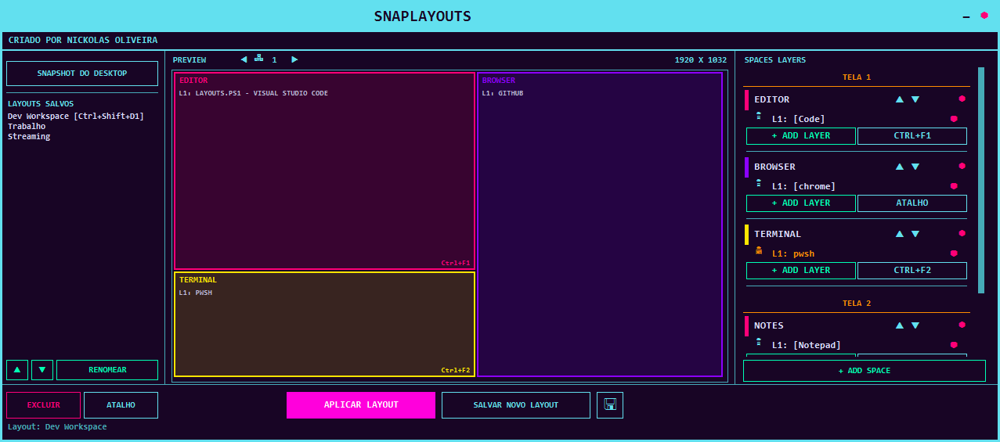

# SnapLayout v2

Gestor de janelas com Spaces, Layers e Atalhos para Windows — sem instalar nada.



## Funcionalidades

- **Snapshot do Desktop** — captura automaticamente o layout atual de todas as janelas abertas, criando um space por janela
- **Spaces com Layers** — cada space representa uma zona da tela; uma janela pode ser adicionada como layer em qualquer space via popup
- **Canvas com aspect ratio da tela** — o preview abre na mesma proporção da sua resolução, facilitando a criação/edição visual dos layouts
- **Edição visual no canvas** — arraste e redimensione os spaces direto no preview; clique com o botão direito sobre um space para selecioná-lo
- **Multi-monitor** — spaces são organizados por tela (TELA 1, TELA 2…) com navegação entre monitores no canvas
- **Atalho por Layout** — associe um hotkey global (ex: `Ctrl+F1`) a um layout salvo para aplicá-lo inteiro de uma vez
- **Atalho por Space** — associe um hotkey global (ex: `Ctrl+F9`) a um space individual; ao pressionar, a janela em foco é movida e encaixada naquele space como nova layer
- **Lock de layer** — trave uma layer a uma janela específica (por handle) em vez de seguir o processo
- **Remoção automática de layers** — quando uma janela é fechada, a layer correspondente some automaticamente
- **Layouts Salvos** — salve, carregue, renomeie, reordene e exclua layouts nomeados; os atalhos de space são persistidos por layout

## Como Usar

1. Execute `layouts.ps1` no PowerShell:
   ```
   powershell -ExecutionPolicy Bypass -File layouts.ps1
   ```
2. Clique em **Snapshot do Desktop** para capturar o layout atual das janelas
3. Ou selecione um layout salvo na lista
4. Ajuste os spaces arrastando-os no canvas, ou use **+ Add Layer** para adicionar uma janela manualmente
5. Clique em **Atalho** num space para configurar um hotkey de encaixe rápido
6. Clique em **Aplicar Layout** para reposicionar todas as janelas dos spaces
7. Clique em **Salvar Novo Layout** para salvar o layout com nome

## Atalhos

- **Atalho de Layout** (botão `Atalho` na barra inferior) — aplica o layout inteiro com um hotkey
- **Atalho de Space** (botão `Atalho` dentro de cada space) — encaixa a janela ativa naquele space

## Requisitos

- Windows 10/11
- PowerShell 5.1+ (sem dependências externas)
